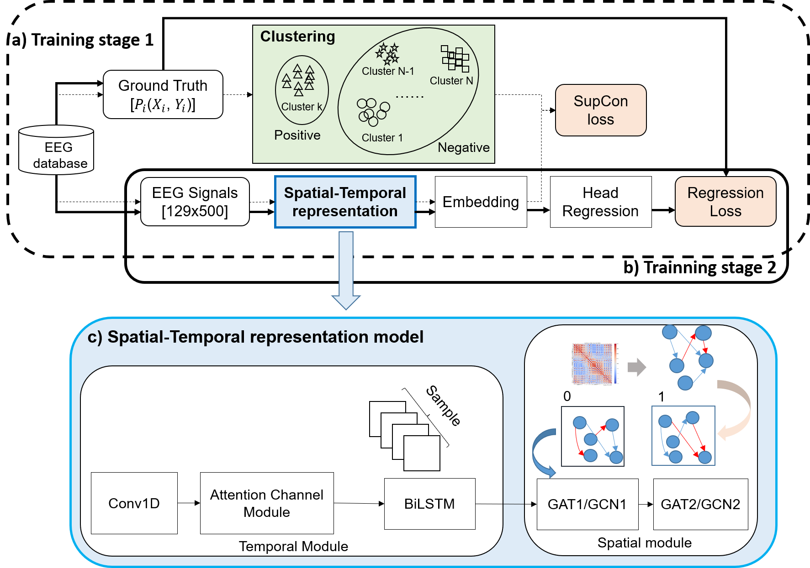
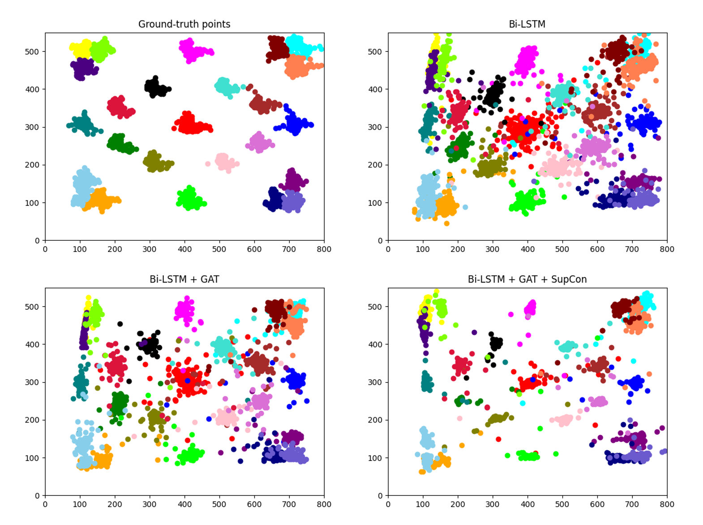

# GACNet: A Graph Attention-Based Neural Network for EEG Localization via Contrastive Learning

## Abstract

EEG-based eye tracking method has faced to many challenges due to the inherently noisy, high-dimensional, and non-stationary nature of brain data. In this work, we propose a novel regression framework, termed GACNet, that effectively integrates spatial-temporal EEG representation, and supervising contrastive learning to enhance regression performance. For encoder representation, a temporal module that employs a 1D convolution layer, channel-wise attention, and a Bi-LSTM network to capture local and long-range temporal dependencies. A spatial module built upon Graph Attention Networks (GATs) or Graph Convolutional Networks (GCNs) to model inter-channel spatial relationships. To further improve representation quality, we utilize a clustering-guided supervised contrastive (SupCon) loss, which explicitly enforces compactness within positive clusters while separating them from negatives in the learned feature space. Joint optimization with regression loss enables the model to learn both discriminative and task relevant representations. Experimental results demonstrate that our proposed method achieves an RMSE of 17.21 mm, significantly outperforming the previous best method at 24.37 mm. This result confirm the effectiveness of integrating spatial-temporal encoding with contrastive learning for robust EEG regression.

## Motivation

EEG signals are inherently spatiotemporal, with both channel-wise dependencies and temporal dynamics. Existing models often focus on either spatial or temporal aspects, leading to sub-optimal representations. Furthermore, many regression models lack robust pretraining mechanisms.

## Our Proposal

We propose a hybrid encoder that integrates:
- **BiLSTM**: for capturing temporal dynamics across time points in EEG sequences.
- **GCN**: for modeling spatial relationships between EEG channels using a predefined electrode graph.
- **SupCon Loss**: a supervised contrastive learning objective that encourages the model to learn more discriminative and robust representations during the pretraining stage.
- 

### Architecture

1. **Input**: EEG signal shaped as `(num_channels × num_timepoints)`
2. **GCN Layer**: Learns spatial relationships between EEG electrodes using a graph structure.
3. **BiLSTM Layer**: Encodes temporal features from the spatial embeddings.
4. **Projection Head** (Pretraining Phase): Used for supervised contrastive learning.
5. **Regression Head** (Fine-tuning Phase): Predicts target continuous values.

---

## 🧠 Dataset Format

- EEGEyeNet data should be formatted as tensors of shape:  
  `X: (N_samples, N_channels, N_timepoints)`  
  `Y: (N_samples, 2)` – for (x, y) regression targets.

- For contrastive pretraining, data must be labeled with discrete **class IDs** or **cluster IDs**:
  - `Y_cls: (N_samples,)` where each entry is a class label for SupCon Loss.

- Example:
  ```python
  X.shape = (1000, 129, 500)
  Y.shape = (1000, 2)         # coordinates
  Y_cls.shape = (1000,)       # cluster/class labels for SupCon

  
## ⚙️ Requirements
<pre> 
  pip3 install -r requirements.txt
  python >= 3.8 
  torch >= 1.12 
  torch-geometric >= 2.0 
  numpy 
  scikit-learn 
  matplotlib 
   </pre>


## 🚀 How to Run

## 1. Pretraining with SupCon Loss


<pre>
python python train_supcon.py  --data_path ./data/eeg_dataset.pt  --output ./checkpoints/encoder.pt  --temperature 0.07 --epochs 100
</pre>

## 2. Fine-tuning for Regression
<pre>
python train_regression.py \
    --data_path ./data/eeg_dataset.pt \
    --pretrained ./checkpoints/encoder.pt \
    --output ./checkpoints/regressor.pt \
    --loss mse \
    --epochs 50
</pre>

## 🚀 Visualize Results



